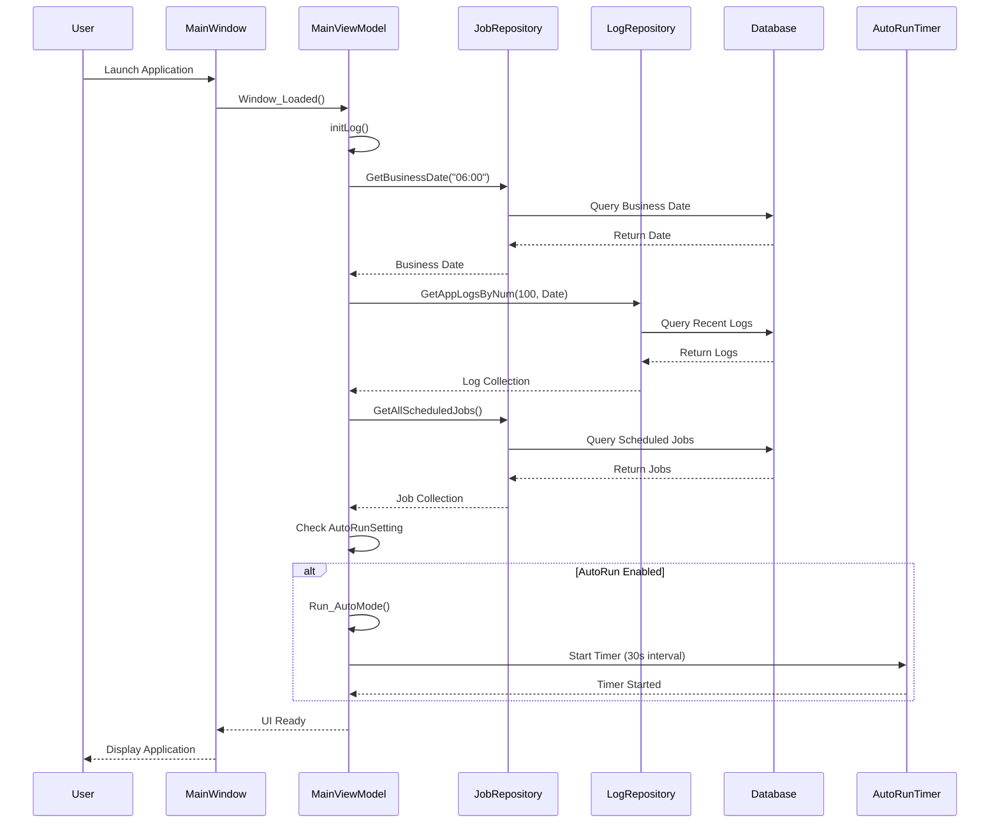
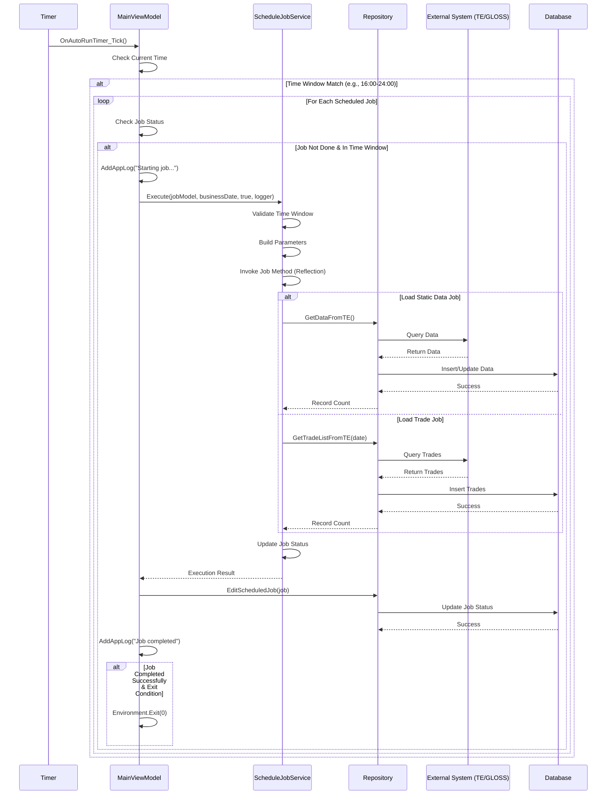
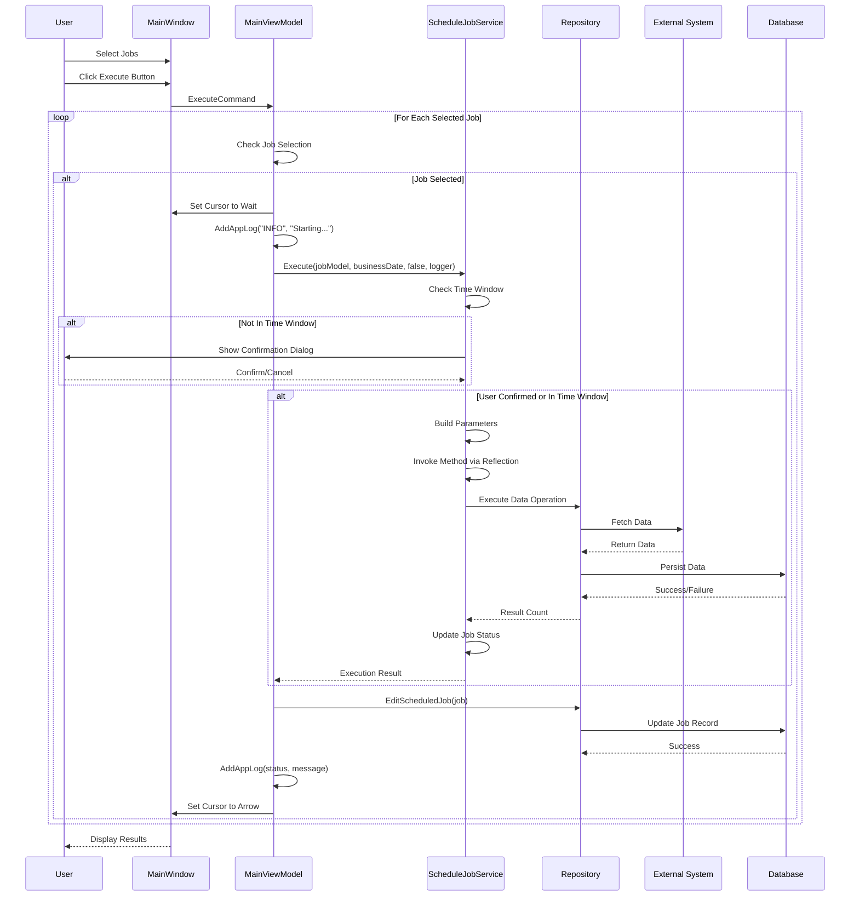
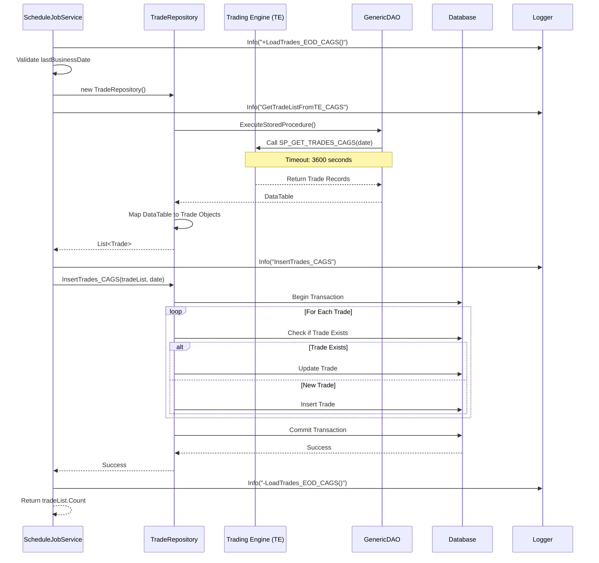
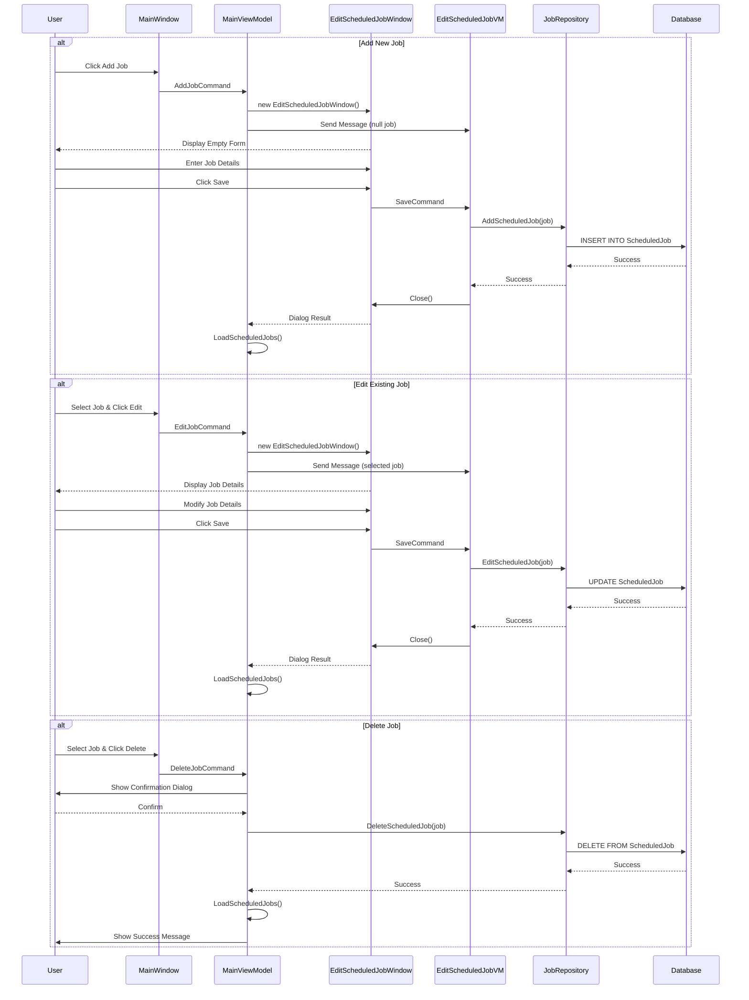
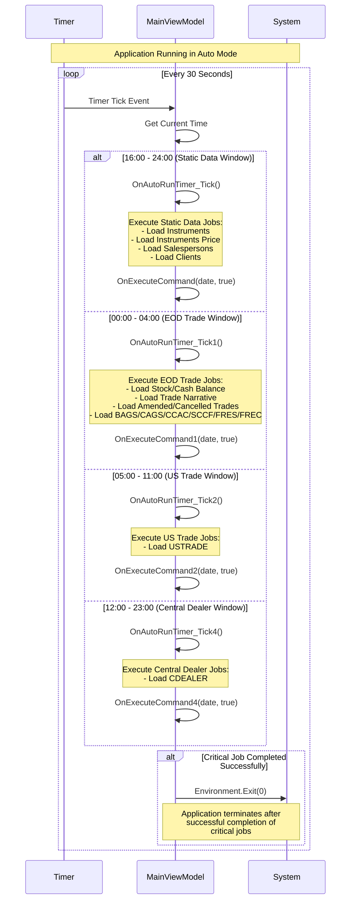
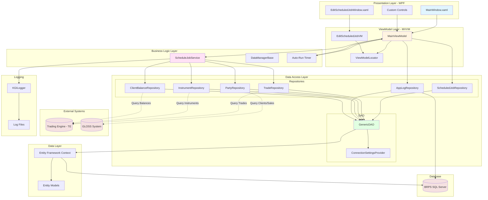
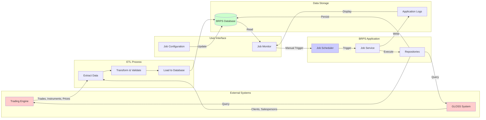

# BRPS System Diagrams

## Table of Contents
1. [System Sequence Diagrams](#system-sequence-diagrams)
2. [Entity Relationship Diagram](#entity-relationship-diagram)
3. [Component Architecture Diagram](#component-architecture-diagram)

---

## System Sequence Diagrams

### 1. Application Startup Sequence

### 2. Auto-Run Mode Execution Sequence

### 3. Manual Job Execution Sequence

### 4. ETL Job Execution Detail (Load Trades Example)

### 5. Job Management Sequence (Add/Edit/Delete)

### 6. Time-Based Job Scheduling Flow

---

## Entity Relationship Diagram

```mermaid
erDiagram
    Party ||--o| Client : "has"
    Party ||--o| Salesperson : "has"
    Party ||--o{ Address : "has multiple"
    
    Client ||--o| ClientAccount : "belongs to"
    ClientAccount ||--o{ Client : "contains"
    
    Trade ||--o| TradeCharge : "has"
    Trade }o--|| Client : "placed by"
    Trade }o--|| Instrument : "trades"
    
    Instrument ||--o| Warrant : "may be"
    Instrument }o--|| Market : "listed on"
    
    ScheduledJob ||--o{ ScheduledJobParam : "has parameters"
    
    Client ||--o{ Client_CashBalance : "has"
    Client ||--o{ Client_StockBalance : "has"
    
    Trade ||--o| Trade_Status : "has status"
    Trade ||--o| Trade_NarrativeInfo : "has narrative"
    Trade ||--o| Trade_Cancelled : "may be cancelled"
    Trade ||--o| TradeCharge_AmendedComm : "may have amendment"
    
    Party {
        string Party_Ref PK
        string Company
        string Party_Category
        int Version_No
        datetime Version_Date
    }
    
    Client {
        string Client_Number PK
        string Party_Ref FK
        string Client_Account_Number FK
        string Client_Title
        string Short_Name
        string Long_Name
        string Marital_Status
        datetime Birth_Incorp_Date
        string SG_PR
        string Identification_Type
        string Unique_ID
        string Issuing_Country
        string Ownership_Category_Code
        string Principal_Business
        string Residence_Code
        string Occupation
        string Employment_Status
        string Client_Type
        string Client_Status
        int Version_No
        datetime Version_Date
        string Status
        string Country
    }
    
    ClientAccount {
        string Client_Account_Number PK
        string Position_Account_Number
        string Position_Account_Category
        string Account_Status
        string Position_Account_Type
        string Remisier_Code
        datetime Created_Date
        datetime Activated_Date
        datetime Closed_Date
        decimal Buy_Limit
        decimal Sell_Limit
        decimal Margin_Credit_Limit
        string Payment_Mode
        string EPS_Link_Status
        string EPS_Bank_No
        string EPS_Bank_Acct
        string Status_Narrative
    }
    
    Salesperson {
        string Salesperson_Ref PK
        string Party_Ref FK
        string Short_Name
        string Long_Name
        string Country
        string Location
        string Title
        string Active
        string Dept_Code
        string Sales_Group
        string MAS_Rep_No
        string SGX_TR_Code
        datetime Joining_Date
        datetime Departure_Date
        int Version_No
        datetime Version_Date
    }
    
    Trade {
        datetime Business_Date PK
        long Trade_No PK
        string Trade_Ref
        string Client_Number FK
        string Trade_Type
        string Sub_Trade_Type
        string Operation_Type
        string Market
        datetime Trade_Date
        datetime Value_Date
        string Instrument FK
        long Qty
        long Open_Qty
        decimal Price
        string Trade_Curr
        decimal Trade_Principal
        string Settle_Curr
        decimal Settle_Amount
        decimal Open_Amount
        decimal Exch_Rate
        string Trade_Status
        string Settle_Status
        string Primary_Book
        string SGX_Trade_No
        string Execution_SalesPerson
        int Trade_Version
        datetime Created_Date
        datetime Amend_Date
    }
    
    TradeCharge {
        datetime Business_Date PK
        long Trade_No PK
        string Curr
        decimal Commission
        decimal Commission_GST
        decimal Clearing_Fee
        decimal Clearing_Fee_GST
        decimal Trading_Fee
        decimal Trading_Fee_GST
        decimal Settlement_Fee
        decimal Stamp_Duty_Fee
        decimal Transaction_Levy_Fee
        decimal Commission_SGD
        decimal Clearing_Fee_SGD
        decimal Trading_Fee_SGD
    }
    
    Instrument {
        string Instr_Ref PK
        string Instr_Group
        string Long_Name
        string Short_Name
        string Main_Market FK
        string Denom_Ccy
        int Denom_Qty
        string Book
        int Price_Decimal_Place
        decimal Price_Divisor
        decimal Price_Multiplier
        string Active_Ind
        datetime Listing_Date
        datetime Delisting_Date
        string ISIN_Code
        string Security_Type
        string Country
        decimal Close_Price
        int Version_No
        datetime Version_Date
    }
    
    ScheduledJob {
        int Job_Id PK
        string Description
        int Depend_Job_Id
        string Occurence
        int Interval
        string From_Time
        string End_Time
        string Process
        int Status
        datetime Business_Date
        datetime Last_Execution_Time
        string Message
    }
    
    ScheduledJobParam {
        int Param_Id PK
        int Job_Id FK
        int Param_Order
        string Param_Name
        string Param_Type
        string Param_Value
    }
    
    Address {
        string Party_Ref FK
        string Address_Type
        string Address_Line_1
        string Address_Line_2
        string City
        string State
        string Postal_Code
        string Country
    }
    
    Market {
        string Market_Code PK
        string Market_Name
        string Country
        string Currency
    }
    
    Warrant {
        string Instr_Ref PK
        string Underlying_Instr
        datetime Expiry_Date
        decimal Strike_Price
        string Warrant_Type
    }
    
    Client_CashBalance {
        string Client_Number PK
        datetime Business_Date PK
        string Currency PK
        decimal Balance_Amount
        decimal Available_Amount
        decimal Blocked_Amount
    }
    
    Client_StockBalance {
        string Client_Number PK
        datetime Business_Date PK
        string Instrument PK
        long Balance_Qty
        long Available_Qty
        long Blocked_Qty
    }
    
    Trade_Status {
        datetime Business_Date PK
        long Trade_No PK
        string Status_Code
        datetime Status_Date
        string Status_Reason
    }
    
    Trade_NarrativeInfo {
        datetime Business_Date PK
        long Trade_No PK
        string Narrative_Type
        string Narrative_Text
    }
    
    Trade_Cancelled {
        datetime Business_Date PK
        long Trade_No PK
        datetime Cancelled_Date
        string Cancelled_Reason
        string Cancelled_By
    }
    
    TradeCharge_AmendedComm {
        datetime Business_Date PK
        long Trade_No PK
        datetime Amendment_Date
        decimal Original_Commission
        decimal Amended_Commission
        string Amendment_Reason
    }
    
    AppLog {
        int Log_Id PK
        datetime Log_Time
        string Job_Desc
        string Status
        string Message
    }
    
    ExchangeRate {
        string From_Curr PK
        string To_Curr PK
        datetime Rate_Date PK
        decimal Exchange_Rate
        string Mult_Div_Ind
    }
    
    Holiday {
        string Market PK
        datetime Holiday_Date PK
        string Holiday_Name
        string Holiday_Type
    }
    
    Instrument_Price {
        string Instr_Ref PK
        datetime Price_Date PK
        decimal Open_Price
        decimal High_Price
        decimal Low_Price
        decimal Close_Price
        long Volume
    }
```

---

## Component Architecture Diagram

### Component Responsibilities

**Presentation Layer:**
- MainWindow: Primary UI for job management and monitoring
- EditScheduledJobWindow: Job configuration interface
- Custom Controls: Reusable UI components (ScheduledJobView, ScheduledJobExpander)

**ViewModel Layer:**
- MainViewModel: Orchestrates job execution, logging, and UI state
- EditScheduledJobVM: Manages job editing operations
- ViewModelLocator: Dependency injection container

**Business Logic Layer:**
- ScheduleJobService: Core ETL execution engine with reflection-based method invocation
- DataManagerBase: Base class for data management operations
- Auto-Run Timer: Time-based job scheduling (30-second intervals)

**Data Access Layer:**
- Repositories: Domain-specific data access (Repository Pattern)
- GenericDAO: Generic database operations with timeout handling
- ConnectionSettingsProvider: Database connection management

**Data Layer:**
- Entity Framework Context: ORM for database operations
- Entity Models: Auto-generated from database schema

**External Systems:**
- Trading Engine (TE): Source for trades, instruments, prices
- GLOSS: Source for client and salesperson data

---

## Data Flow Diagram

---

*Diagrams generated on November 21, 2025*
